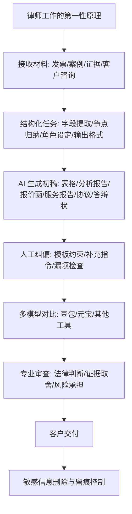

# 03-06 内部会议纪要：AI 在法律实务中的应用

- 整理范围：基于当前转写文本，内容截至 `00:18:40`
- 会议主题：AI 在律师高频工作中的实际应用与团队落地
- 整理方法：用第一性原理拆解法律服务流程，再映射 AI 可提效环节

## 一句话结论

- AI 在法律实务中的核心价值，不是替律师承担判断责任，而是把大量可结构化、可模板化、可重复的中间劳动压缩到分钟级；律师仍然负责问题定义、策略取舍、结果校验与执业责任。

## Mermaid 流程图

## 第一性原理拆解

### 1. 法律服务的本质

- 输入层：事实材料、证据、案例、合同、客户诉求
- 处理层：结构化、归纳、比对、匹配规则、形成论证
- 输出层：表格、咨询意见、服务方案、报告、协议、答辩状、报价函
- 不可外包的核心：责任判断、策略选择、风险兜底、最终签发

### 2. AI 真正适合介入的环节

- 高重复
- 高格式化
- 高信息密度
- 对速度敏感但允许人工复核

### 3. AI 不能省略的动作

- 给足背景、角色、格式和口径
- 用模板约束输出
- 连续追问补漏，避免偷项和漏项
- 对结果做事实与法律校验
- 处理隐私、删除敏感数据、控制留痕

## 会议主要内容

### 一、发票整理：最典型的“低判断、高重复、高格式”场景

- 过去做法：人工逐张登记发票，耗时且枯燥
- 当前做法：一次上传约 `50` 张 PDF 发票，让 AI 按既定表格结构抽取信息
- 关键指令：明确字段，如序号、开票日期、开票内容、金额、开票单位、税号、发票号码
- 关键指令：提供发票登记模板作为输出约束
- 关键指令：明确要求“每一份不能少”，防止模型漏掉部分票据
- 现场经验：几秒内可得到初步登记结果
- 现场经验：工具能力已从“文本可复制”升级到“可直接生成 Excel”
- 风险点：可能漏张、漏字段、识别不全
- 风险点：需要通过模板和补充指令反复纠偏
- 纪要结论：这是最适合优先标准化、优先 AI 化的环节

### 二、案例批量归纳：AI 的价值不止是摘要，而是提炼可诉可辩的抓手

- 场景来源：处理股权争议等案件时，需要从无讼、威科等系统批量下载案例
- 当前做法：一次上传几十个案例，要求 AI 统一整理判决时间、法院、基本案情、争议焦点、主要证据、裁判结果
- 进一步用法：指定角色或诉讼立场，如原告、被告、胜诉点、特定争议点
- 进一步用法：让 AI 从案例堆中继续抽取支持某一论证方向的具体材料
- 风险点：上传 `50` 个案例，不代表能自动完整总结 `50` 个
- 风险点：需要继续追问，明确“剩余案例补充完整”
- 纪要结论：AI 可以把“海量案例阅读”转成“结构化争点分析”，但不能省略律师对裁判逻辑的判断

### 三、法律文书写作：AI 最适合做高质量初稿引擎

- 会议提到的应用对象：报价函、服务方案、年度或阶段性服务报告、咨询回复、协议草案、答辩状
- 基本方法：上传旧模板
- 基本方法：说明本次项目背景、客户需求和交付口径
- 基本方法：明确角色定位，如资深律师、法官视角、公司法律师视角等
- 基本方法：要求结合事实、法律法规和实践经验生成文本
- 现场经验：很多初稿可以在 `1` 到 `5` 分钟内得到
- 现场经验：往往只需调整格式、措辞或少量事实细节，就能进入可交付状态
- 核心前提：律师自己必须先完成基本判断
- 核心前提：再告诉 AI 要从哪些角度展开论证、引用什么材料、服务什么目标
- 纪要结论：AI 能显著压缩初级、重复性的文书劳动，但不能替代律师的立场设计和责任承担

### 四、组织层观察：行业真正的问题不是工具不够，而是没有真正下场

- 现场举手反馈显示：经常用 AI 做完整 PPT 或长流程任务的人并不多
- 现场举手反馈显示：在同一步工作里同时使用 `3` 个以上 AI 的人更少
- 发言重点：单点使用某一个工具，只能拿到局部收益
- 发言重点：真正的竞争力来自亲自进入工作流、持续试错、横向比较多个模型输出
- 行业背景判断：律师行业普遍面临案源不稳定、获客压力大、同质化严重
- 行业背景判断：AI 的价值不仅是省时间，也包括提升营销展示、检索响应和团队协同速度
- 会议态度：不要停留在“AI 好不好用”的讨论
- 会议态度：要把 AI 放进合同审查、检索、谈判支持、报价、报告和交付全过程里反复打磨

## 从第一性原理得到的会议共识

- 结论 1：法律服务的交付，本质上是把复杂事实转化为结构化判断与文本输出，所以 AI 最适合介入中间加工层。
- 结论 2：提效不来自某一句“神奇提示词”，而来自“材料 + 模板 + 明确字段 + 角色设定 + 连续追问 + 人工复核”的组合。
- 结论 3：模型会偷懒、漏项、跑偏，律师不能把校验步骤外包给工具。
- 结论 4：单一工具不是终局，多模型对比和经验判断才会形成稳定工作流。
- 结论 5：AI 可以压缩初级重复劳动，但不能替代律师对事实真实性、法律适用、策略取舍和执业责任的承担。

## 可直接落地的工作流

- 第 1 步：先判断任务类型
- 说明：是抽取、归纳、检索、写作，还是策略分析
- 第 2 步：准备输入材料
- 说明：原始文件、案例包、证据、旧模板、背景说明
- 第 3 步：定义输出标准
- 说明：字段、结构、角色、语气、篇幅、格式
- 第 4 步：先出初稿，再追问补漏
- 说明：明确“不能漏任何一项”
- 第 5 步：交叉验证
- 说明：用第二个模型或人工抽检做核对
- 第 6 步：专业定稿
- 说明：律师保留判断、修改与签发
- 第 7 步：做合规收尾
- 说明：删除敏感信息，控制留痕，遵守最小必要披露原则

## 风险与边界

- 隐私风险：客户咨询、协议、证据材料都可能包含敏感信息
- 准确性风险：模型可能漏项、误读材料、编造依据
- 责任风险：AI 输出不能直接替代律师意见
- 依赖风险：如果只会“问一句”，不会设计工作流，提效会非常有限

## 建议的后续动作

- 把发票登记、案例归纳、报价函、服务报告、答辩状分别沉淀成统一提示词模板
- 为每个场景建立“必填字段 + 常见漏项检查清单”
- 在团队内确定至少 `2` 到 `3` 个常用模型做交叉验证
- 对涉及客户隐私的材料，形成脱敏、上传、删除的操作规范
- 从“个人会用”升级到“团队并行协作”，把检索、摘要、文书起草嵌入日常流程

## 纪要式结论

- 本次会议不是在讨论 AI 要不要用，而是在讨论律师团队如何把 AI 从演示工具变成生产工具。
- 会议已经明确，高频、重复、格式化的法律工作最先值得标准化和 AI 化。
- 下一阶段重点不在继续听概念，而在沉淀模板、建立校验机制、推进团队落地。
